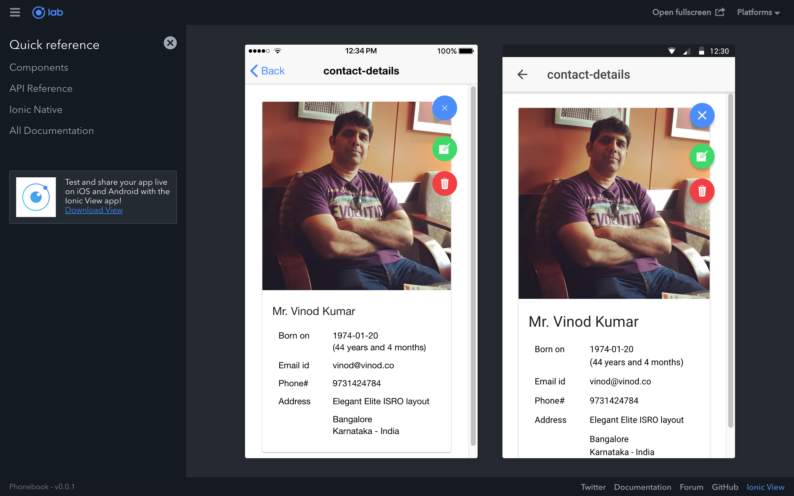
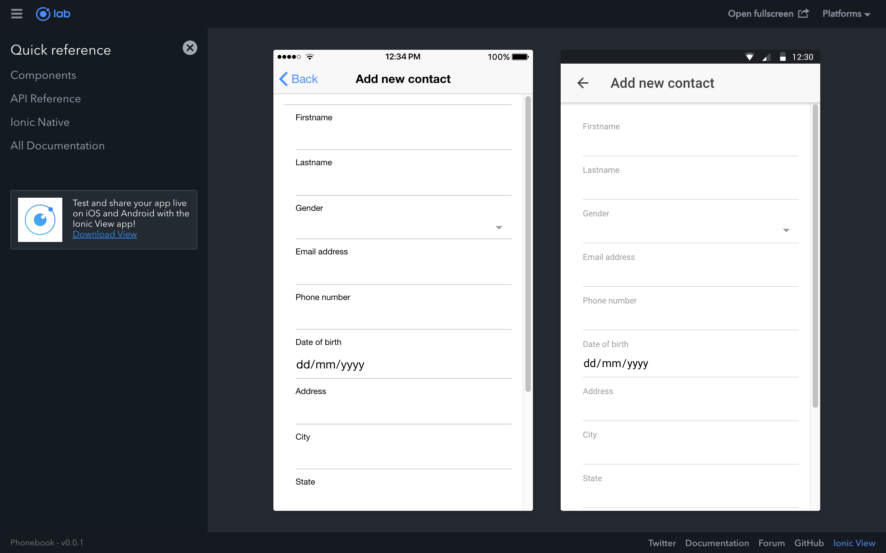

## Ionic 3 training @ Unisys

The folder "phonebook" is the ionic project folder and the "rest-endpoint" is the node project to serve data via REST.

### How to run the REST endpoint?

* Open a command prompt (Windows users) or a terminal (Mac users)
* CD into the "rest-endpoint" folder
* Run the `npm i` command, which installs the dependencies
* Run the `npm start` command which starts the REST server at port 3000
* You can verify by accessing http://localhost:3000/contacts using a browser

### How to run the Ionic App?

* Open a command prompt (Windows users) or a terminal (Mac users)
* CD into the "phonebook" folder
* Run the `ionic serve` command, which starts the dev server and opens a browser automatically with URL http://localhost:8100
* You may also change it http://localhost:8100/ionic-lab to see the same in lab view

### How to build Android app?

* Run the `ionic cordova platform add android` command
* Run the `ionic cordova run android --livereload --consolelog --stacktrace` command to deploy the app in a connected mobile phone or emulater

Note:

* On your phone, make sure to enable *USB debugging* and *Install app via USB*

---

Visit https://vinod.co for online training requirements.
